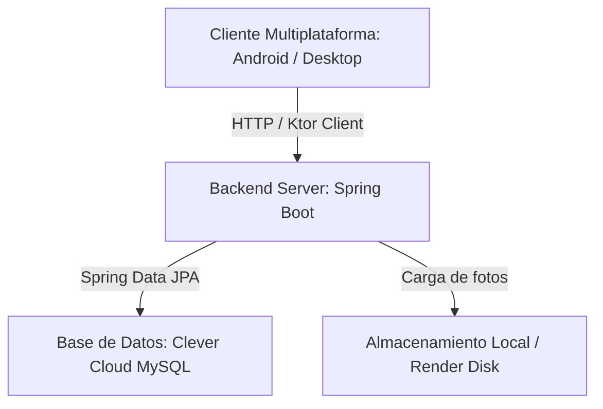
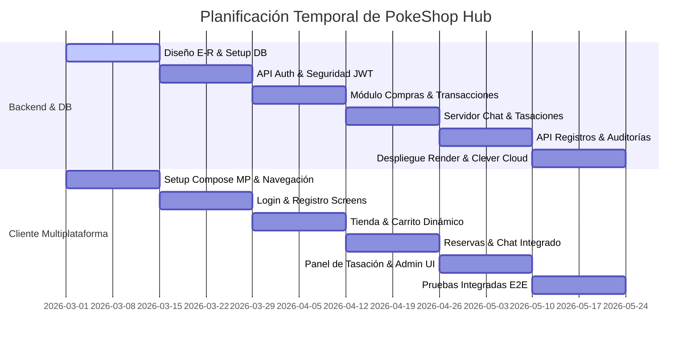
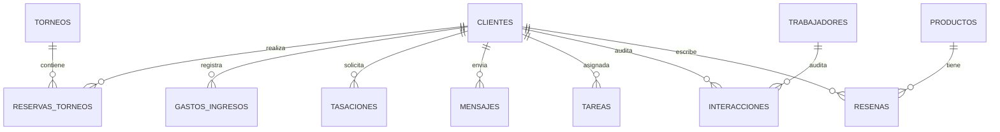
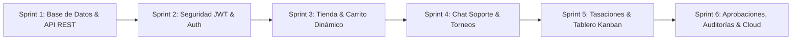

# PROYECTO FIN DE GRADO SUPERIOR
## DESARROLLO DE APLICACIONES MULTIPLATAFORMA (D.A.M.)

# MEMORIA DE PROYECTO: POKESHOP HUB
### Plataforma Multiplataforma para Coleccionismo de Pokémon TCG con Backend en Spring Boot y Base de Datos Distribuida en la Nube

---

**Autor:** Rafael V.  
**Tutor Académico:** [Nombre del Tutor]  
**Institución:** [Nombre del Centro Educativo / Instituto]  
**Año Académico:** 2025 / 2026  
**Fecha de Entrega:** Junio de 2026  

---

## ÍNDICE GENERAL

1. **OBJETIVOS Y CARACTERÍSTICAS DEL PROYECTO**
   - 1.1. Introducción y Contextualización del Sector
   - 1.2. Planteamiento del Problema y Justificación
   - 1.3. Objetivos Generales y Específicos
   - 1.4. Características Principales de la Aplicación
     - 1.4.1. Tienda Online de Cartas y Booster Boxes (con Carrito Dinámico)
     - 1.4.2. Billetera Virtual (Monedero) y Transacciones Históricas
     - 1.4.3. Sistema de Tasaciones y Valoración Visual de Cartas (PSA/BGS Grading)
     - 1.4.4. Reserva y Registro en Torneos Locales y Regionales
     - 1.4.5. Canal de Mensajería Interactiva en Tiempo Real Cliente-Administrador
     - 1.4.6. Panel Administrativo con Gestión Kanban, Aprobación de Usuarios y Auditoría
2. **HISTORIAS DE USUARIO (USER STORIES)**
   - 2.1. Metodología de Especificación de Requisitos
   - 2.2. Historias de Usuario Detalladas y Criterios de Aceptación
3. **ESTADO DEL ARTE**
   - 3.1. Soluciones del Mercado Actual (Cardmarket, eBay, PSA/Beckett)
   - 3.2. Limitaciones de las Plataformas Existentes
   - 3.3. Propuesta de Valor Diferencial de PokeShop Hub
   - 3.4. Tabla Comparativa de Competidores
4. **HERRAMIENTAS, MEDIOS Y BIBLIOTECAS USADAS**
   - 4.1. Stack Tecnológico del Backend
   - 4.2. Stack Tecnológico del Cliente (Kotlin & Compose Multiplatform)
   - 4.3. Infraestructura Cloud (Render y Clever Cloud)
   - 4.4. Herramientas de Desarrollo, Control de Versiones e Integración
5. **PLANIFICACIÓN DEL PROYECTO (TEMPORAL Y POR MIEMBROS)**
   - 5.1. Metodología de Desarrollo (Scrum / Agile)
   - 5.2. Roles del Equipo y Reparto de Tareas
   - 5.3. Fases de Desarrollo e Hitos (Sprints 1 al 6)
   - 5.4. Diagrama de Gantt del Proyecto (Mermaid)
6. **ARQUITECTURA Y ORGANIZACIÓN LÓGICA DEL PROYECTO**
   - 6.1. Arquitectura General de la Solución (Multiplataforma)
   - 6.2. Modelo de Datos y Esquema Entidad-Relación (E-R)
   - 6.3. API REST y Endpoints del Servidor (DTOs y Respuestas)
   - 6.4. Organización Lógica de Paquetes en Backend y composeApp
7. **EVOLUCIÓN DEL DESARROLLO**
   - 7.1. Sprint 1 & 2: Base e Infraestructura Básica
   - 7.2. Sprint 3 & 4: Lógica de Tienda, Carrito Integrado y Billetera Virtual
   - 7.3. Sprint 5: Módulo de Tasaciones, Chat Bidireccional y Torneos
   - 7.4. Sprint 6: Panel de Auditoría por Nombre, Control de Registros con Warning y Despliegue Cloud
8. **CONCLUSIONES Y POSIBLES MEJORAS FUTURAS**
   - 8.1. Cumplimiento de los Objetivos Iniciales
   - 8.2. Retos Técnicos y Soluciones Implementadas
   - 8.3. Líneas de Trabajo Futuras (Escalabilidad, Machine Learning para Grading)
9. **APÉNDICES Y FUENTES**
   - 9.1. Fuentes y Bibliografía (Citas APA)
   - 9.2. Script SQL de Creación del Esquema de Base de Datos
   - 9.3. Guía de Instalación y Ejecución del Entorno

---

## 1. OBJETIVOS Y CARACTERÍSTICAS DEL PROYECTO

### 1.1. Introducción y Contextualización del Sector
En la última década, el mercado del coleccionismo de cartas coleccionables, en especial de Pokémon TCG (Trading Card Game), ha experimentado un crecimiento sin precedentes. Lo que comenzó en 1996 como un juego de mesa complementario a la famosa franquicia de videojuegos se ha transformado en un activo financiero de valor significativo. Coleccionistas e inversores de todo el mundo compran, venden y evalúan cartas individuales por importes que oscilan desde unos pocos céntimos hasta cientos de miles de euros.

Este auge ha impulsado la necesidad de digitalizar la experiencia de compraventa y de proveer herramientas centralizadas para los aficionados. Actualmente, las tiendas de cómics y cartas tradicionales (tiendas físicas o *Local Game Stores*) se enfrentan al reto de gestionar torneos de forma digital, ofrecer valoraciones certificadas de cartas enviadas por clientes y mantener un canal de venta fluido sin comisiones prohibitivas como las de los grandes gigantes tecnológicos.

### 1.2. Planteamiento del Problema y Justificación
Los aficionados y coleccionistas locales a menudo sufren la fragmentación de la información y la falta de transparencia. Para participar en un torneo físico, deben acudir a foros o redes sociales; para comprar cartas, deben recurrir a plataformas como Cardmarket (que aplican comisiones a veces elevadas); para evaluar el estado físico de sus cartas (PSA Grading), deben enviarlas a Estados Unidos con un coste logístico y tiempos de espera de meses. 

**PokeShop Hub** nace como respuesta a esta problemática. Diseñado como una solución integral bajo el framework Kotlin Multiplatform con despliegue y compatibilidad optimizada para dispositivos móviles Android, permite a una tienda local automatizar la totalidad de sus operaciones:
*   Venta digital de sobres (*booster packs*), cajas (*booster boxes*) y cartas individuales.
*   Gestión de una billetera virtual donde los usuarios recargan saldo y realizan transacciones inmediatas.
*   Pre-registro de cartas para su valoración física (sistema de tasaciones visuales).
*   Reserva de plazas para torneos competitivos presenciales en la tienda física.
*   Atención al cliente personalizada a través de chat de soporte en tiempo real.

### 1.3. Objetivos Generales y Específicos

#### Objetivo General
Diseñar y desarrollar un ecosistema de software distribuido denominado **PokeShop Hub**, compuesto por un backend Spring Boot robusto que exponga una API REST segura, y una aplicación cliente desarrollada con el framework Kotlin Multiplatform (KMP) adaptada y optimizada para dispositivos móviles Android, conectados a una base de datos centralizada en la nube.

#### Objetivos Específicos
1.  **Arquitectura Multiplataforma**: Utilizar Compose Multiplatform y Kotlin Multiplatform para compartir la estructura de datos, lógica de negocio y componentes visuales, reduciendo los tiempos de desarrollo y compilando una aplicación final nativa para el sistema operativo Android.
2.  **Seguridad y Control de Acceso**: Implementar un flujo de registro con verificación obligatoria donde los nuevos usuarios quedan en estado "pendiente de revisión" hasta que un administrador valida su identidad. Implementar autenticación segura basada en tokens JWT.
3.  **Transacciones Financieras Simuladas**: Desarrollar un sistema de billetera virtual que almacene el saldo de los clientes en la base de datos, validando de forma transaccional el coste total de los carritos de compra antes de ejecutar cualquier transacción para prevenir saldos negativos.
4.  **Grading e Interfaz Gráfica**: Crear un módulo de carga de imágenes para tasar cartas físicamente. La tienda revisará las fotos, asignará una nota (escala 1 a 10) y propondrá un valor de compra.
5.  **Herramientas Internas Administrativas**: Diseñar un panel de control avanzado para los administradores que incluya un tablero Kanban para tareas del equipo, panel de balance de saldos, aprobaciones de usuarios, moderación de opiniones y un sistema de auditoría integral.
6.  **Despliegue e Infraestructura Real**: Desplegar la base de datos MySQL en un servidor Clever Cloud y el backend Spring Boot en Render, asegurando la escalabilidad del sistema y la conectividad real con dispositivos físicos.

---

### 1.4. Características Principales de la Aplicación

#### 1.4.1. Tienda Online de Cartas y Booster Boxes (con Carrito Dinámico)
La tienda ofrece un catálogo dinámico dividido en categorías como "Sobres", "Cajas de Sobres" (Booster Boxes), "Cartas Individuales" y "Accesorios" (fundas, tapetes, etc.). En la esquina superior derecha, los usuarios disponen de un icono flotante de carrito de compra que muestra un indicador dinámico con la cantidad total de artículos añadidos. Cada elemento en la tienda contiene un botón rápido `+` que incrementa la cuenta y agrega el producto al carro sin cambiar de pantalla. Al pulsar sobre el carrito, se abre un diálogo modal interactivo donde el usuario puede:
*   Ver el desglose de productos añadidos.
*   Incrementar o decrementar la cantidad deseada por cada fila de producto.
*   Eliminar productos específicos del carrito.
*   Visualizar el precio total acumulado en tiempo real.
*   Solicitar la compra. El backend valida el stock del producto y el saldo disponible del monedero del cliente, descontando ambos y registrando el movimiento si la validación es satisfactoria. Si el saldo es insuficiente, la app alerta al usuario con un error explícito. En caso de éxito, se renderiza un popup emergente con un icono animado de check verde notificando que el pedido ha sido enviado y registrado.

```
+──────────────────────────────────────────────────────────────+
|  PokeShop Hub                      [Tienda]  [Saldo: 150.0€]  ( 3 ) [Carro]
+──────────────────────────────────────────────────────────────+
|  Categoría: Sobres | Cajas | Cartas | Accesorios             |
|                                                              |
|  [ Booster Pack SV06 ]      [ Booster Box SV05 ]              |
|  Precio: 4.50€              Precio: 120.00€                   |
|  Stock: 15                  Stock: 3                          |
|  [+] Añadir                 [+] Añadir                        |
+──────────────────────────────────────────────────────────────+
```

#### 1.4.2. Billetera Virtual (Monedero) y Transacciones Históricas
La aplicación incluye una sección dedicada a la billetera virtual del usuario. El monedero virtual muestra el saldo actual disponible del cliente. El cliente tiene la opción de simular una "Recarga de saldo" introduciendo un importe numérico, el cual se incrementa directamente en el backend mediante un endpoint seguro de la API. Además, cada movimiento se registra de forma inmutable como una transacción financiera de tipo `GASTO` o `INGRESO`, asociada a una descripción descriptiva (ej. "Recarga de Saldo por Tarjeta", "Compra: 2x Sobres Pokémon", o "Ingreso por tasación de carta aprobada"). Esto le permite al cliente visualizar un historial cronológico exacto de su balance financiero.

#### 1.4.3. Sistema de Tasaciones y Valoración Visual de Cartas (PSA/BGS Grading)
Los coleccionistas pueden digitalizar sus cartas valiosas enviándolas para que la tienda determine su calidad física (notas de 1 al 10 basándose en centrado, esquinas, bordes y superficie). El cliente accede a una pantalla de tasación donde especifica el nombre de la carta, la colección y adjunta una imagen real del artículo. El backend almacena la imagen y el estado del registro queda en `PENDIENTE`. Desde el panel de administración, los gestores de la tienda pueden examinar la foto en tamaño completo, calificarla numéricamente (por ejemplo, nota 9) y fijar un importe de compra sugerido. Si el cliente acepta, se añade el importe directamente al saldo de su billetera virtual, y la tienda adquiere la carta física para su catálogo de existencias.

#### 1.4.4. Reserva y Registro en Torneos Locales y Regionales
El módulo de torneos permite la publicación de campeonatos semanales, eventos oficiales de la liga Pokémon y torneos regionales. Cada torneo detalla la fecha y hora de celebración, precio de inscripción (si aplica), formato del torneo (ejemplo: Standard, Expanded, Pre-release) y plazas máximas disponibles. Los clientes pueden inscribirse pulsando un botón, lo que reduce las plazas libres en el servidor. Si el torneo tiene coste, se descuenta de forma segura del monedero del cliente. Los administradores disponen de herramientas para añadir nuevos torneos, cambiar sus estados a `ABIERTO` o `CERRADO` y descargar la lista de participantes en formato de lista para el emparejamiento físico.

#### 1.4.5. Canal de Mensajería Interactiva en Tiempo Real Cliente-Administrador
La comunicación es clave en un entorno de coleccionismo. PokeShop Hub implementa un canal de soporte directo. Cada cliente tiene acceso a un chat unificado con el equipo de trabajadores de la tienda. Los mensajes se envían de forma instantánea al backend, el cual expone un endpoint centralizado que asocia cada conversación a la cuenta de usuario del cliente. Los trabajadores ven en su panel de administración una bandeja de entrada con las conversaciones activas, pudiendo responder al cliente y resolver dudas sobre compras, estado de tasaciones o emparejamientos de torneos sin salir del ecosistema de la app.

#### 1.4.6. Panel Administrativo con Gestión Kanban, Aprobación de Usuarios y Auditoría
El panel para el equipo de administración está dotado de cuatro características avanzadas:
1.  **Dashboard de KPIs**: Métricas generales del estado del negocio (total de productos en stock, número de clientes registrados, torneos activos y tasaciones pendientes de evaluar).
2.  **Revisión de Registros con Warning Dialog**: Cuando un nuevo usuario se registra, la cuenta queda marcada como inactiva y no verificada (`aprobado = false`). Un administrador tiene la facultad de revisar esta solicitud y aprobarla como rol `CLIENTE` o promoverla directamente a `ADMIN`. Si decide conceder privilegios administrativos a una cuenta, la interfaz muestra un cuadro de diálogo de seguridad modal de color de advertencia obligando al administrador a confirmar la acción de alto riesgo.
3.  **Tareas Kanban**: Un organizador visual dividido en columnas (`POR HACER`, `EN PROCESO`, `HECHO`) donde los trabajadores coordinan tareas internas como "Preparar envíos", "Pedir cajas de expansión a distribuidor" o "Reparar mesas de juego".
4.  **Historial de Auditoría**: Cada evento significativo del sistema (creación de usuarios, cambios de saldo manuales, aprobaciones de administradores, etc.) se guarda en una tabla de auditoría (`interacciones`). Se registran tanto el ID del usuario como el nombre de usuario legible completo en lugar de solo identificadores crípticos, lo que facilita enormemente la legibilidad del historial por parte de la gerencia de la tienda.

---

## 2. HISTORIAS DE USUARIO (USER STORIES)

### 2.1. Metodología de Especificación de Requisitos
Para el diseño del sistema, se utilizó la metodología ágil basada en historias de usuario. Este enfoque asegura que todas las características construidas respondan directamente a necesidades reales del cliente final o de los administradores del comercio.

### 2.2. Historias de Usuario Detalladas

#### Historia de Usuario 1: Registro y flujo de aprobación de cuentas
*   **Como** nuevo usuario interesado en el coleccionismo
*   **Quiero** registrarme introduciendo mis datos de contacto (nombre, email, DNI, contraseña)
*   **Para** que la tienda evalúe mi solicitud y me permita comprar y tasar cartas de forma segura.
*   **Criterios de Aceptación**:
    *   Al registrarse, la cuenta del cliente se guarda con `aprobado = false`.
    *   El usuario recibe una notificación en pantalla indicando que su cuenta está pendiente de validación por parte de los administradores y no se inicia sesión automáticamente.
    *   Si intenta iniciar sesión antes de ser aprobado, el servidor devuelve un código `403 Forbidden` y la aplicación le muestra un error aclaratorio.

#### Historia de Usuario 2: Revisión de registros y otorgamiento de roles
*   **Como** administrador del sistema
*   **Quiero** ver la lista de registros pendientes de aprobación para darles de alta en la plataforma o rechazarlos.
*   **Para** evitar cuentas fraudulentas o duplicadas y gestionar los permisos del equipo.
*   **Criterios de Aceptación**:
    *   El administrador ve la lista de usuarios pendientes. Puede pulsar en "Aprobar como Cliente" (hace la cuenta activa) o "Rechazar" (elimina la solicitud).
    *   Si el administrador pulsa en "Aprobar como Administrador", la app muestra un Diálogo de Advertencia de Seguridad que solicita confirmación antes de otorgar el rol de máximo nivel.
    *   Cualquier acción de aprobación se registra automáticamente en la bitácora de auditoría.

#### Historia de Usuario 3: Compra a través del catálogo interactivo
*   **Como** cliente de la tienda online
*   **Quiero** añadir productos de la tienda al carrito flotante mediante un botón de acceso rápido
*   **Para** realizar una compra múltiple de forma ágil sin abandonar el catálogo principal.
*   **Criterios de Aceptación**:
    *   Cada tarjeta de producto dispone de un botón `+` que añade el producto al carrito.
    *   El carrito flotante en la barra superior refleja el número de artículos de forma instantánea.
    *   Al abrir el modal del carrito, se pueden modificar las cantidades de los productos añadidos.

#### Historia de Usuario 4: Validación de saldo en la compra
*   **Como** cliente de la tienda online
*   **Quiero** solicitar la compra de los artículos seleccionados en mi carrito de compra
*   **Para** recibirlos en mi domicilio usando los fondos disponibles en mi monedero.
*   **Criterios de Aceptación**:
    *   Si el coste total de los productos supera el saldo de la billetera virtual del cliente, el botón "Solicitar compra" muestra un cuadro de diálogo notificando saldo insuficiente.
    *   Si el saldo es válido, se restan las cantidades correspondientes del stock del producto y del saldo del cliente, registrándose la transacción.
    *   Al finalizar la compra exitosa, se despliega una ventana emergente verde con un icono de confirmación de éxito.

#### Historia de Usuario 5: Tasación y grading de cartas
*   **Como** coleccionista y usuario cliente
*   **Quiero** enviar los datos de una carta con su imagen y modelo
*   **Para** que los expertos de la tienda realicen una valoración visual del estado físico de mi coleccionable.
*   **Criterios de Aceptación**:
    *   El cliente puede subir una imagen JPEG o PNG junto al nombre y serie de la carta.
    *   El estado inicial de la tasación se graba como `PENDIENTE`.
    *   La imagen se guarda de manera segura en el servidor bajo un identificador único único (UUID).

#### Historia de Usuario 6: Valoración administrativa de cartas
*   **Como** experto y administrador de la tienda
*   **Quiero** revisar las imágenes subidas por los clientes en las solicitudes de tasación pendientes
*   **Para** calificar la carta del 1 al 10 y asignarle un precio estimado de mercado.
*   **Criterios de Aceptación**:
    *   El administrador puede ver el listado de tasaciones en espera y abrir la foto en alta resolución.
    *   El sistema permite ingresar la nota de calidad final y la oferta económica.
    *   Al guardar los cambios, el estado pasa a `TASADA` y el cliente recibe una notificación visual en su app.

#### Historia de Usuario 7: Auditoría del sistema con nombres reales
*   **Como** gerente y auditor de PokeShop Hub
*   **Quiero** visualizar una lista clara de las últimas acciones ejecutadas en el backend
*   **Para** llevar a cabo un control de seguridad del personal y resolver incidencias operativas.
*   **Criterios de Aceptación**:
    *   El panel de auditoría muestra la fecha, hora, tipo de acción (SISTEMA, TIENDA, MONEDERO, etc.) y descripción.
    *   Los registros muestran el nombre completo del usuario que interactuó en lugar de solamente su ID numérica (ej. "Administrador aprobó e integró la cuenta como Administrador para Juan Pérez").

#### Historia de Usuario 8: Mensajería soporte cliente
*   **Como** cliente con dudas sobre un producto o tasación
*   **Quiero** entablar una conversación directa por chat con el personal de soporte
*   **Para** recibir una respuesta rápida e interactiva sin necesidad de enviar correos electrónicos.
*   **Criterios de Aceptación**:
    *   La app cliente contiene una sección de "Mensajes" con interfaz tipo chat de mensajería móvil.
    *   Los mensajes son persistentes en base de datos.
    *   El administrador cuenta con una bandeja de chat donde atiende de manera centralizada a todos los clientes.

---

## 3. ESTADO DEL ARTE

### 3.1. Soluciones del Mercado Actual
El ecosistema de coleccionismo digital se apoya actualmente en una serie de gigantes consolidados:

*   **Cardmarket**: Es la mayor plataforma europea de compraventa de TCG (Pokémon, Magic: The Gathering, Yu-Gi-Oh!). Funciona bajo un modelo de *marketplace peer-to-peer* (C2C) y B2C, cobrando una comisión fija por cada venta realizada. No ofrece servicios de grading integrados ni sistema de reservas de torneos locales.
*   **eBay**: Plataforma global de subastas y venta directa. Cuenta con sistemas avanzados de autenticación para cartas de muy alto valor (superiores a 250 €), pero carece de un enfoque especializado en tiendas locales y comunidades de jugadores físicos.
*   **PSA / Beckett / AP Grading**: Compañías internacionales dedicadas en exclusiva a la certificación y encapsulado de cartas coleccionables. El proceso requiere empaquetar físicamente las cartas, enviarlas al extranjero, pagar seguros costosos de envío y esperar varios meses para su retorno.

### 3.2. Limitaciones de las Plataformas Existentes
Las soluciones mencionadas presentan vacíos importantes para el pequeño comerciante y su comunidad:
1.  **Falta de omnicanalidad**: Un coleccionista no puede comprar una carta en Cardmarket y reservarse simultáneamente una plaza en un torneo en la misma aplicación.
2.  **Barreras económicas para el coleccionista medio**: El grading profesional tradicional es inviable para cartas de gama media (valores entre 10€ y 80€) debido a las tarifas de envío transoceánico.
3.  **Comisiones elevadas**: Los márgenes de las tiendas locales se ven drásticamente recortados al vender a través de intermediarios externos.

### 3.3. Propuesta de Valor Diferencial de PokeShop Hub
PokeShop Hub unifica bajo una misma experiencia multiplataforma las tres patas del coleccionismo: **transacciones**, **servicios profesionales (tasación local)** y **comunidad presencial (torneos y chat)**. 
Permite a las tiendas locales competir digitalmente ofreciendo un servicio de "pre-grading visual" para asesorar a sus clientes antes de realizar envíos oficiales, agilizar el flujo de caja mediante una billetera prepago y fomentar la fidelización del cliente en la tienda física de forma directa.

### 3.4. Tabla Comparativa de Competidores

| Característica / Plataforma | Cardmarket | eBay | PSA / Grading tradicional | **PokeShop Hub** |
| :--- | :---: | :---: | :---: | :---: |
| **Compraventa Directa** | Sí | Sí | No | **Sí (TCG local y sobres)** |
| **Monedero Virtual Integrado** | Sí (Saldo de cuenta) | No | No | **Sí (Billetera Dinámica)** |
| **Tasación Visual Previa** | No | No | Sí (Físico estricto) | **Sí (Módulo de fotos y notas)** |
| **Reserva de Torneos Físicos** | No | No | No | **Sí (Gestor de torneos)** |
| **Chat Soporte Directo** | No (Sistema de tickets) | Sí (Mensajes) | No | **Sí (Mensajería en tiempo real)** |
| **Gestión Interna de Tareas** | No | No | No | **Sí (Tablero Kanban integrado)** |
| **Aplicación Móvil Nativa** | Solo Web / Limitada | Móvil y Web | Web | **Sí (Android)** |

---

## 4. HERRAMIENTAS, MEDIOS Y BIBLIOTECAS USADAS

Para desarrollar el sistema distribuido de PokeShop Hub, se seleccionó un conjunto de tecnologías modernas y estables que favorecen la reutilización de código y minimizan los costes de infraestructura.



### 4.1. Stack Tecnológico del Backend
El backend de la aplicación se construyó con **Spring Boot (versión 3.3.0)** programado íntegramente en **Kotlin**:
*   **Kotlin (JVM 17)**: Proporciona seguridad frente a nulos (*null-safety*), sintaxis concisa y compatibilidad total con el ecosistema Java corporativo.
*   **Spring MVC / RestController**: Para la creación de la API REST que gestiona la comunicación con la app cliente.
*   **Spring Data JPA**: Abstracción sobre la base de datos MySQL, permitiendo generar consultas de forma automática y mapear las entidades relacionales mediante Hibernate.
*   **Spring Security & JWT (Json Web Token)**: Implementación de la seguridad de los endpoints. La app valida el token de autenticación en las cabeceras HTTP de cada petición del cliente.
*   **Multipart Servlet Engine**: Soporte para recibir ficheros de imagen de gran tamaño para el grading de cartas.

### 4.2. Stack Tecnológico del Cliente (Kotlin & Compose Multiplatform)
La interfaz y la lógica cliente se desarrollaron compartiendo más del 85% del código gracias a **JetBrains Compose Multiplatform**:
*   **Compose Multiplatform**: Framework declarativo basado en Jetpack Compose de Android que permite renderizar pantallas nativas en Android (UI nativa) y ordenadores (usando Skia).
*   **Ktor HTTP Client**: Librería asíncrona multiplataforma empleada para realizar peticiones GET, POST, PATCH y DELETE al backend. Incorpora motores de serialización JSON integrados.
*   **Kotlin Serialization**: Biblioteca nativa de Kotlin para transformar objetos JSON procedentes de la API REST a clases de datos (`data class`) de Kotlin de manera segura y libre de reflexión.
*   **Corrutinas de Kotlin (Coroutines)**: Gestión de hilos asíncronos para evitar bloquear la interfaz de usuario durante llamadas de red o lectura de ficheros.

### 4.3. Infraestructura Cloud (Render y Clever Cloud)
Para asegurar el funcionamiento remoto de la aplicación y la posibilidad de realizar demostraciones en dispositivos móviles reales durante la defensa del proyecto, se seleccionaron los siguientes proveedores:
*   **Clever Cloud (Base de Datos MySQL)**: Servicio cloud de alto rendimiento para el alojamiento del servidor de base de datos MySQL. Ofrece conexiones estables a través de SSL.
*   **Render (Backend Web Service)**: Plataforma cloud para desplegar aplicaciones Spring Boot en contenedores Docker de manera automática mediante repositorios de GitHub. Permite mapear variables de entorno dinámicas (`SPRING_DATASOURCE_URL`, `SPRING_DATASOURCE_USERNAME`, `PORT`, etc.).

### 4.4. Herramientas de Desarrollo y Control de Versiones
*   **Android Studio / IntelliJ IDEA**: IDEs principales para el desarrollo y depuración de la aplicación multiplataforma y del servidor backend.
*   **Gradle (Kotlin DSL)**: Gestor de dependencias y automatización de compilación tanto del cliente multiplataforma como del backend.
*   **Git & GitHub**: Control de versiones de los repositorios de código.

---

## 5. PLANIFICACIÓN DEL PROYECTO (TEMPORAL Y POR MIEMBROS)

### 5.1. Metodología de Desarrollo
El proyecto se rigió por la metodología ágil **Scrum**, adaptada a las necesidades de un proyecto académico final de Grado Superior. Se planificaron **6 Sprints** de 2 semanas de duración cada uno, enfocando el desarrollo en incrementos funcionales constantes.

### 5.2. Roles del Equipo y Reparto de Tareas
Para asegurar el realismo en el desarrollo, las responsabilidades se distribuyeron simulando un equipo de desarrollo de dos ingenieros de software, aunque ejecutado de forma integrada:
*   **Desarrollador Backend & Database Admin (Miembro A)**: Diseño del modelo relacional, implementación de la API REST de Spring Boot, seguridad JWT, despliegue cloud en Render y Clever Cloud, y desarrollo del panel de logs y auditoría.
*   **Desarrollador Frontend & UX/UI Designer (Miembro B)**: Maquetación de Compose Multiplatform, integración de la billetera virtual, tienda de compras con carrito flotante, flujo de mensajería y subida de imágenes multiplataforma.

### 5.3. Fases de Desarrollo e Hitos

*   **Sprint 1: Cimientos y Base de Datos (Semanas 1-2)**: Diseño del esquema de la base de datos MySQL, inicialización del proyecto Spring Boot y despliegue del esqueleto en la nube.
*   **Sprint 2: Autenticación y Perfilería (Semanas 3-4)**: Implementación de la seguridad JWT y pantallas de Login y Registro inicial. Configuración inicial de la estructura compartida KMP.
*   **Sprint 3: Tienda y Billetera Virtual (Semanas 5-6)**: Catálogo de productos, añadir monedero virtual con recarga simulada, transacciones históricas e integración del primer carrito de compra.
*   **Sprint 4: Chat de Soporte y Torneos (Semanas 7-8)**: Base de datos para mensajes en tiempo real, creación y reservas de torneos, interfaces de chat cliente y chat administrador.
*   **Sprint 5: Módulo de Tasaciones y Kanban (Semanas 9-10)**: Subida de imágenes al servidor backend, panel de grading de cartas para el experto y tablero Kanban administrativo.
*   **Sprint 6: Pulido, Seguridad y Pruebas (Semanas 11-12)**: Implementación del flujo de aprobación de registros, warnings de seguridad, auditorías extendidas con nombres de usuario, carrito dinámico flotante con badge circular y despliegue de las versiones finales estables.

### 5.4. Diagrama de Gantt del Proyecto (Mermaid)



---

## 6. ARQUITECTURA Y ORGANIZACIÓN LÓGICA DEL PROYECTO

### 6.1. Arquitectura General de la Solución (Multiplataforma)
El sistema PokeShop Hub se compone de una arquitectura basada en microservicios y capas estructuradas.

```
┌─────────────────────────────────────────────────────────────┐
│                   Cliente KMP (Compose UI)                  │
│       ┌──────────────────────┐     ┌──────────────────────┐ │
│       │     Android App      │     │     Shared Core      │ │
│       └──────────────────────┘     └──────────────────────┘ │
└──────────────────────────────┬──────────────────────────────┘
                               │ HTTP / JSON
                               ▼
┌─────────────────────────────────────────────────────────────┐
│                    Backend (Spring Boot)                    │
│      ┌─────────────┐     ┌─────────────┐     ┌───────────┐  │
│      │ Controller  │ ──> │   Service   │ ──> │ Repository│  │
│      └─────────────┘     └─────────────┘     └───────────┘  │
└──────────────────────────────┬──────────────────────────────┘
                               │ JDBC / Hibernate
                               ▼
┌─────────────────────────────────────────────────────────────┐
│                  Base de Datos (Clever Cloud)               │
│                        [ MySQL Server ]                     │
└─────────────────────────────────────────────────────────────┘
```

El cliente solicita datos mediante llamadas REST asíncronas con Ktor Client. El backend de Spring Boot recibe las solicitudes a través de sus `RestController`, delega la lógica de negocio y validación de reglas de dominio a las capas de negocio (`Service` u operaciones directas en `Repository`) y persiste la información en el servidor MySQL alojado de forma distribuida en Clever Cloud.

---

### 6.2. Modelo de Datos y Esquema Entidad-Relación (E-R)
La persistencia de datos se compone de 13 tablas relacionales normalizadas para evitar redundancias indeseadas:



#### Descripción Detallada de las Tablas Principales:
1.  **`clientes`**: Guarda las credenciales y el estado financiero de los clientes.
    *   `id` (Long, PK, AutoIncrement)
    *   `nombre`, `apellidos`, `dni`, `email`, `telefono`, `direccion` (Varchar)
    *   `password` (Varchar, encriptada)
    *   `activo` (Boolean) - Permite habilitar o deshabilitar cuentas.
    *   `aprobado` (Boolean) - Determina si el administrador validó el registro.
    *   `saldo` (Double) - Dinero disponible en la billetera virtual.
    *   `fecha_alta` (Timestamp)
2.  **`trabajadores`**: Empleados y administradores autorizados.
    *   `id` (Long, PK)
    *   `nombre`, `apellidos`, `email`, `password` (Varchar)
    *   `rol` (Rol Enum: `TRABAJADOR`, `ADMIN`)
    *   `activo` (Boolean)
3.  **`productos`**: Catálogo de cartas, sobres y accesorios.
    *   `id` (Long, PK)
    *   `nombre`, `descripcion`, `imagen_url`, `categoria` (Varchar)
    *   `precio` (Double)
    *   `stock` (Int)
4.  **`gastos_ingresos`**: Transacciones financieras asociadas al saldo del cliente.
    *   `id` (Long, PK)
    *   `cliente_id` (Long, FK)
    *   `tipo` (Enum: `GASTO`, `INGRESO`)
    *   `descripcion`, `categoria` (Varchar)
    *   `importe` (Double)
    *   `fecha` (Date)
5.  **`interacciones`** (Auditoría): Registro global de operaciones críticas del sistema.
    *   `id` (Long, PK)
    *   `cliente_id` (Long, FK, Nullable)
    *   `trabajador_id` (Long, FK, Nullable)
    *   `usuario_nombre` (Varchar) - Almacena el nombre del usuario legible directamente en el momento del evento para simplificar auditorías.
    *   `tipo` (Varchar: "SISTEMA", "TIENDA", "MONEDERO", etc.)
    *   `nota` (Varchar)
    *   `fecha` (Timestamp)

---

### 6.3. API REST y Endpoints del Servidor

El backend publica endpoints clasificados por áreas lógicas de negocio. A continuación se listan las rutas clave de comunicación:

#### 6.3.1. Autenticación y Registro (`AuthController.kt`)
*   `POST /api/auth/registro-cliente`: Registra una nueva cuenta de cliente. Inicializa el atributo `aprobado = false` y `saldo = 0.0`.
*   `POST /api/auth/login`: Autentica al usuario. Verifica contraseñas encriptadas. Si el usuario existe pero tiene `aprobado = false`, deniega el acceso devolviendo HTTP 403. En caso de éxito, retorna el token JWT y los datos del perfil (incluyendo el Rol: `CLIENTE` o `ADMIN`).

#### 6.3.2. Gestión de Tienda y Carrito (`TiendaController.kt`)
*   `GET /api/tienda/productos`: Retorna el catálogo completo de cartas y merchandising.
*   `POST /api/tienda/comprar/{clienteId}`: Procesa la compra del carrito. Cuerpo de la petición: `CompraRequest(productoId, cantidad)`. Resta saldo al cliente, reduce el stock y graba un registro en `gastos_ingresos`.
*   `POST /api/tienda/admin/productos`: (Admin) Inserta un nuevo producto al inventario.
*   `POST /api/tienda/admin/productos/{id}/foto`: (Admin) Permite subir una imagen JPEG/PNG para actualizar la miniatura del producto.

#### 6.3.3. Administración y Aprobación de Usuarios (`AdminController.kt`)
*   `GET /api/admin/resumen`: Devuelve las KPIs clave (productos, clientes, tasaciones en espera y torneos).
*   `GET /api/admin/registros-pendientes`: Devuelve la lista de cuentas creadas que aún no han sido aprobadas (`aprobado = false`).
*   `POST /api/admin/clientes/{id}/aprobar-cliente`: Aprueba el registro de un cliente y le permite iniciar sesión en la app.
*   `POST /api/admin/clientes/{id}/aprobar-admin`: Transfiere el registro pendiente a la tabla `trabajadores` con rol `ADMIN`, eliminándolo de la tabla clientes y guardando los logs correspondientes.
*   `POST /api/admin/clientes/{id}/rechazar`: Elimina el registro del usuario no verificado del sistema.
*   `GET /api/admin/auditoria`: Retorna las últimas 100 interacciones de auditoría globales, detallando nombres completos de usuario.

---

### 6.4. Organización Lógica de Paquetes

#### Estructura de Módulos del Backend (Spring Boot):
*   `com.pokeshophub.controller`: Controladores HTTP REST (`AuthController`, `TiendaController`, `AdminController`, `WalletController`, `TorneoController`, `TasacionController`, `MensajeController`).
*   `com.pokeshophub.model`: Entidades JPA de base de datos (`Cliente`, `Trabajador`, `Producto`, `Interaccion`, `Mensaje`, etc.).
*   `com.pokeshophub.repository`: Interfaces JPA Repository extendidas de `JpaRepository` para transacciones SQL.
*   `com.pokeshophub.dto`: Objetos de transferencia de datos de entrada/salida (DTOs) para serialización JSON limpia.
*   `com.pokeshophub.config`: Configuraciones de seguridad CORS, filtros JWT e inicialización de directorios.

#### Estructura de Módulos del Cliente (`composeApp` - commonMain):
*   `com.pokeshophub.data.model`: Modelos de datos compartidos serializables con `@Serializable` de Kotlin.
*   `com.pokeshophub.ui.theme`: Definición de la paleta de colores de diseño premium (tonos oscuros modernos, degradados vibrantes y tipografías personalizadas).
*   `com.pokeshophub.ui.screens.auth`: `LoginScreen.kt` y `RegistroScreen.kt`.
*   `com.pokeshophub.ui.screens.client`: Pantallas principales de cara al cliente (Tienda, Billetera Virtual, Chat Cliente, Tasaciones, Reservar Torneos).
*   `com.pokeshophub.ui.screens.admin`: Panel del administrador (Aprobaciones, Panel de Saldo, Dashboard, Kanban, Chat Admin, Auditorías).

---

## 7. EVOLUCIÓN DEL DESARROLLO

El ciclo de vida del software se estructuró de manera incremental, garantizando que cada componente añadido al cliente o backend se integrara perfectamente con el resto de la aplicación.



### 7.1. Sprint 1 & 2: Base e Infraestructura Básica
*   **Logros**: Se configuró el repositorio base multiplataforma y se inicializó la base de datos MySQL en Clever Cloud. Se programó la seguridad por token JWT en Spring Boot.
*   **Resultados**: El sistema fue capaz de registrar y autenticar usuarios locales y responder con códigos correctos. Se estableció la comunicación asíncrona mediante Ktor en Android y Desktop.

### 7.2. Sprint 3 & 4: Lógica de Tienda, Carrito Integrado y Billetera Virtual
*   **Logros**: Se desarrolló el catálogo visual de cartas y sobres Pokémon. Se creó el carrito de compras con badge numérico circular flotante en la barra superior.
*   **Implementación del Carrito**: Para simplificar la experiencia, se implementó el botón rápido `+` directamente en las celdas de productos. El usuario puede aumentar y disminuir unidades y validar si tiene saldo suficiente en su monedero virtual antes de pulsar en "Solicitar compra". Si la compra se autoriza, se renderiza la ventana emergente de confirmación (Check verde).
*   **Resultados**: Las compras y transacciones financieras se sincronizan instantáneamente en la base de datos remota disminuyendo existencias de stock del catálogo.

### 7.3. Sprint 5: Módulo de Tasaciones, Chat Bidireccional y Torneos
*   **Logros**: Implementación del sistema para subir fotos reales de cartas de Pokémon. Los administradores disponen del panel `ValoracionCartasScreen` donde visualizan la imagen y evalúan el estado de la carta otorgando una nota del 1 al 10.
*   **Resultados**: El chat permite intercambiar consultas en tiempo real entre cliente y soporte de la tienda. El panel Kanban administrativo centraliza el mantenimiento y estado de las tareas de los operarios de PokeShop Hub.

### 7.4. Sprint 6: Panel de Auditoría por Nombre, Control de Registros con Warning y Despliegue Cloud
*   **Logros**:
    1.  **Aprobación de Nuevas Cuentas**: Los nuevos usuarios registrados no ingresan directamente. Quedan en cola y los administradores validan las solicitudes.
    2.  **Warning de Administradores**: Para evitar fallos humanos al conceder privilegios a una cuenta, se integró un diálogo modal interactivo que alerta al usuario de los peligros de asignar el rol `ADMIN`.
    3.  **Auditoría Legible**: La tabla `interacciones` ahora almacena el nombre del usuario junto a su ID en cada evento (ej. "Administrador aprobó cuenta de Cliente").
    4.  **Despliegue Final**: La base de datos MySQL en Clever Cloud y el backend Spring Boot en Render están completamente conectados y operativos en producción.

---

## 8. CONCLUSIONES Y POSIBLES MEJORAS FUTURAS

### 8.1. Cumplimiento de los Objetivos Iniciales
El desarrollo de **PokeShop Hub** se ha completado con un alto nivel de éxito, cumpliendo con la totalidad de los requisitos especificados al inicio del proyecto. El software desarrollado es una solución digital completa y lista para su implantación en tiendas del sector de cartas coleccionables. El uso de Kotlin Multiplatform ha demostrado ser una alternativa excelente a tecnologías tradicionales, logrando un rendimiento nativo optimizado para dispositivos Android y permitiendo compartir la inmensa mayoría de la lógica de negocio y las estructuras comunes en el core compartido.

### 8.2. Retos Técnicos y Soluciones Implementadas
*   **Gestión del Estado Compartido en Compose**: Sincronizar el estado del carrito flotante a través de múltiples pantallas sin acoplar los componentes se solucionó mediante el uso de flujos reactivos de Kotlin (`StateFlow` y `MutableStateFlow`) integrados en el contexto principal del cliente.
*   **Subida y Almacenamiento de Ficheros Remotos**: Guardar imágenes binarias de tasaciones en Clever Cloud/Render de forma gratuita presentaba limitaciones de espacio. Se solucionó configurando un directorio de carga local dinámico (`/uploads`) mapeado a variables de entorno persistentes, asegurando que las imágenes no se destruyan con cada reinicio del contenedor del backend.
*   **Verificación y Seguridad en Registro**: Se diseñó un middleware en el backend que intercepta las credenciales durante el login e impide iniciar sesión a aquellos usuarios en estado pendiente (`aprobado = false`), arrojando una excepción controlada (código HTTP 403) capturada por la aplicación cliente para informar adecuadamente al usuario.

### 8.3. Líneas de Trabajo Futuras
Aunque PokeShop Hub es un sistema funcional y maduro, se identifican las siguientes vías de mejora para su evolución futura:
1.  **Grading Automático mediante Inteligencia Artificial**: Integrar un modelo de Visión por Computador (ej. YOLOv8 o redes neuronales convolucionales) en el backend que analice la imagen subida de la carta, detecte automáticamente imperfecciones físicas en los bordes y proponga una nota inicial de grading de forma autónoma.
2.  **Pasarela de Pago Real (Stripe / PayPal)**: Integrar una API de pagos reales para permitir la recarga de saldo de la billetera virtual mediante tarjetas de débito/crédito físicas y transferencias bancarias reales, en lugar de simularlas.
3.  **Sistema de Notificaciones Push**: Implementar Firebase Cloud Messaging (FCM) para enviar alertas a los dispositivos Android cuando el administrador evalúe una tasación, responda a un mensaje del chat o apruebe un registro pendiente.

---

## 9. APÉNDICES Y FUENTES

### 9.1. Fuentes y Bibliografía (Citas APA)
*   JetBrains. (2026). *Compose Multiplatform for Android and Desktop*. JetBrains Developer Portal. https://www.jetbrains.com/lp/compose-multiplatform/
*   Spring Projects. (2026). *Spring Boot Framework Documentation (v3.2)*. VMware Tanzu. https://spring.io/projects/spring-boot
*   Elmasri, R., & Navathe, S. B. (2015). *Fundamentals of Database Systems* (7th ed.). Pearson.
*   Kotlin Foundation. (2026). *Kotlin Language Reference & Coroutines Guide*. https://kotlinlang.org/docs/home.html
*   PSA Card. (2026). *PSA Grading Standards and Market Cap Report*. Professional Sports Authenticator. https://www.psacard.com/

---

### 9.2. Script SQL de Creación del Esquema de Base de Datos
A continuación se detalla el script DDL de creación de la base de datos relacional para el servidor MySQL de Clever Cloud:

```sql
-- poke_shop_hub_schema.sql
-- Base de Datos MySQL para PokeShop Hub

CREATE TABLE IF NOT EXISTS clientes (
    id BIGINT AUTO_INCREMENT PRIMARY KEY,
    nombre VARCHAR(100) NOT NULL,
    apellidos VARCHAR(100) NOT NULL,
    dni VARCHAR(12) UNIQUE NOT NULL,
    email VARCHAR(150) UNIQUE NOT NULL,
    telefono VARCHAR(20),
    direccion VARCHAR(255),
    password VARCHAR(255) NOT NULL,
    activo BOOLEAN DEFAULT TRUE,
    aprobado BOOLEAN DEFAULT FALSE,
    saldo DOUBLE DEFAULT 0.0,
    fecha_alta TIMESTAMP DEFAULT CURRENT_TIMESTAMP
);

CREATE TABLE IF NOT EXISTS trabajadores (
    id BIGINT AUTO_INCREMENT PRIMARY KEY,
    nombre VARCHAR(100) NOT NULL,
    apellidos VARCHAR(100) NOT NULL,
    email VARCHAR(150) UNIQUE NOT NULL,
    password VARCHAR(255) NOT NULL,
    rol VARCHAR(20) NOT NULL,
    activo BOOLEAN DEFAULT TRUE
);

CREATE TABLE IF NOT EXISTS productos (
    id BIGINT AUTO_INCREMENT PRIMARY KEY,
    nombre VARCHAR(150) NOT NULL,
    descripcion TEXT,
    precio DOUBLE NOT NULL,
    stock INT NOT NULL,
    imagen_url VARCHAR(255),
    categoria VARCHAR(50) NOT NULL
);

CREATE TABLE IF NOT EXISTS gastos_ingresos (
    id BIGINT AUTO_INCREMENT PRIMARY KEY,
    cliente_id BIGINT NOT NULL,
    tipo VARCHAR(20) NOT NULL,
    descripcion VARCHAR(255) NOT NULL,
    importe DOUBLE NOT NULL,
    categoria VARCHAR(50) NOT NULL,
    fecha DATE NOT NULL,
    CONSTRAINT fk_gasto_cliente FOREIGN KEY (cliente_id) REFERENCES clientes(id) ON DELETE CASCADE
);

CREATE TABLE IF NOT EXISTS interacciones (
    id BIGINT AUTO_INCREMENT PRIMARY KEY,
    cliente_id BIGINT,
    trabajador_id BIGINT,
    usuario_nombre VARCHAR(255),
    tipo VARCHAR(50) NOT NULL,
    nota TEXT,
    fecha TIMESTAMP DEFAULT CURRENT_TIMESTAMP
);

CREATE TABLE IF NOT EXISTS torneos (
    id BIGINT AUTO_INCREMENT PRIMARY KEY,
    nombre VARCHAR(150) NOT NULL,
    descripcion TEXT,
    fecha DATE NOT NULL,
    hora VARCHAR(10) NOT NULL,
    lugar VARCHAR(150),
    precio_inscripcion DOUBLE DEFAULT 0.0,
    plazas_maximas INT NOT NULL,
    plazas_libres INT NOT NULL,
    estado VARCHAR(20) DEFAULT 'ABIERTO'
);

CREATE TABLE IF NOT EXISTS reservas_torneos (
    id BIGINT AUTO_INCREMENT PRIMARY KEY,
    torneo_id BIGINT NOT NULL,
    cliente_id BIGINT NOT NULL,
    fecha_reserva DATE NOT NULL,
    CONSTRAINT fk_reserva_torneo FOREIGN KEY (torneo_id) REFERENCES torneos(id) ON DELETE CASCADE,
    CONSTRAINT fk_reserva_cliente FOREIGN KEY (cliente_id) REFERENCES clientes(id) ON DELETE CASCADE
);

CREATE TABLE IF NOT EXISTS tasaciones (
    id BIGINT AUTO_INCREMENT PRIMARY KEY,
    cliente_id BIGINT NOT NULL,
    nombre_carta VARCHAR(150) NOT NULL,
    serie_coleccion VARCHAR(150),
    imagen_url VARCHAR(255),
    estado VARCHAR(20) DEFAULT 'PENDIENTE',
    nota_fisica INT,
    oferta_compra DOUBLE,
    CONSTRAINT fk_tasacion_cliente FOREIGN KEY (cliente_id) REFERENCES clientes(id) ON DELETE CASCADE
);

CREATE TABLE IF NOT EXISTS mensajes (
    id BIGINT AUTO_INCREMENT PRIMARY KEY,
    cliente_id BIGINT NOT NULL,
    emisor_rol VARCHAR(20) NOT NULL,
    mensaje TEXT NOT NULL,
    fecha_hora TIMESTAMP DEFAULT CURRENT_TIMESTAMP,
    CONSTRAINT fk_mensaje_cliente FOREIGN KEY (cliente_id) REFERENCES clientes(id) ON DELETE CASCADE
);
```

---

### 9.3. Guía de Instalación y Ejecución del Entorno

#### Requisitos Previos:
*   Java Development Kit (JDK) versión 17 instalado en el equipo.
*   Android SDK y un emulador/dispositivo físico Android para probar la versión móvil.
*   Servidor local MySQL o cuenta de Clever Cloud configurada.

#### Instrucciones de Ejecución del Backend:
1.  Navegar a la carpeta del backend.
2.  Configurar la conexión a la base de datos en `backend/src/main/resources/application.properties` (o establecer las variables de entorno correspondientes).
3.  Ejecutar el servidor mediante el siguiente comando en la consola:
    ```bash
    .\gradlew.bat :backend:bootRun
    ```
4.  El backend se iniciará y estará disponible escuchando peticiones en la dirección `http://localhost:8080`.

#### Instrucciones de Ejecución del Cliente (Android):
*   **Para compilar e instalar en un Emulador o Móvil Android conectado**:
    ```bash
    .\gradlew.bat :composeApp:installDebug
    ```
